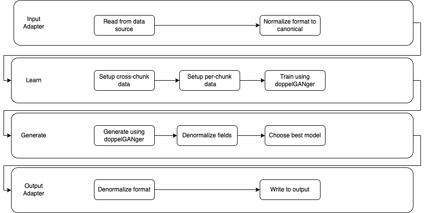

# Practical GAN-based Synthetic IP Header Trace Generation using NetShare

**Update 8/23/2022: We are currently porting full funtionalities from the branch [`camera-ready`](https://github.com/netsharecmu/NetShare/tree/camera-ready) as a python package. Please checkout [`camera-ready`](https://github.com/netsharecmu/NetShare/tree/camera-ready) branch if you would like to replicate all the experiments in the [paper](https://dl.acm.org/doi/abs/10.1145/3544216.3544251)**.

[[paper (SIGCOMM 2022)](https://dl.acm.org/doi/abs/10.1145/3544216.3544251)][[talk (SIGCOMM 2022)](https://www.youtube.com/watch?v=mWnFIncjtWg)][[web service demo](https://drive.google.com/file/d/1vPuneEb14A2w7fKyCJ41NAHzsvpLQP5H/view)]

**Authors:** [[Yucheng Yin](https://sniperyyc.com/)] [[Zinan Lin](http://www.andrew.cmu.edu/user/zinanl/)] [[Minhao Jin](https://www.linkedin.com/in/minhao-jin-1328b8164/)] [[Giulia Fanti](https://www.andrew.cmu.edu/user/gfanti/)] [[Vyas Sekar](https://users.ece.cmu.edu/~vsekar/)]

**Abstract:** We explore the feasibility of using Generative Adversarial Networks (GANs) to automatically learn generative models to generate synthetic packet- and flow header traces for network-ing tasks (e.g., telemetry, anomaly detection, provisioning). We identify key fidelity, scalability, and privacy challenges and tradeoffs in existing GAN-based approaches. By synthesizing domain-specific insights with recent advances in machine learning and privacy, we identify design choices to tackle these challenges. Building on these insights, we develop an end-to-end framework, NetShare. We evaluate NetShare on six diverse packet header traces and find that: (1) across distributional metrics and traces, it achieves 46% more accuracy than baselines, and (2) it meets users’ requirements of downstream tasks in evaluating accuracy and rank ordering of candidate approaches.

# Overview
<p align="center">
  
</p>
<p align="center">
  Figure 1: Overview of the NetShare workflow
</p>

As shown in Figure 1, we envision a common workflow for NetShare: real data (e.g., PCAPs) stream in as different epochs, where each Di could represent the pcap generated on Day i or Hour i. The entire workflow splits into two phases:

- **Offline stage (*optional*):** a few epochs of *real data* is merged into one giant trace and is fed into the hyperparameter tuning process along with the fidelity specification. The fidelity spec specifies users' fidelity requirements among different hyperparameter settings and training snapshots. A typical fidelity spec could be choosing the parameters/snapshot with lowest Jensen-Shannon divergence or choosing the setup with the best performance of a particular downstream task (e.g., anomaly detection).

- **Online stage:** After the *optional* hyperparameter selection process, new streaming *real data* (e.g., Di+1, ...) is fed into the model training and generation part with the hyperparameter chosen during the offline stage. Note that if you find the *synthetic data* (Di+1') and *real data* (Di+1), you may repeat the hyperparameter tuning process in the offline stage.

**Note that in our [SIGCOMM paper](https://dl.acm.org/doi/abs/10.1145/3544216.3544251) version, we only include the offline stage where hyperparameter tuning is compulsory. This overview is a more complete workflow we envision in the real-world deployment.**

# Datasets
***We are adding more datasets! Feel free to add your own and contribute!***

Our paper uses **six** public datasets for reproducibility. Please download the six datasets [here](https://drive.google.com/drive/folders/1FOl1VMr0tXhzKEOupxnJE9YQ2GwfX2FD?usp=sharing) and put them under `traces/`.

You may also refer to the [README](traces/README.md) for detailed descriptions of the datasets.


# Getting started
## Step 1: Install NetShare Python package (Required)
We recommend installing NetShare in a virtual environment (e.g., Anaconda3 or virtualenv). We test with virtual environment with Python==3.6.

```Bash
# Assume Anaconda is installed
# Create virtual environment if not exists
conda create --name NetShare python=3.6

# Activate virtual env
conda activate NetShare

# Install NetShare package
git clone https://github.com/netsharecmu/NetShare.git
cd NetShare/
pip3 install -e .
```
Two alternatives for installing NetShare:
* If you use AWS adapters (e.g. to read data from an S3 bucket), install with `pip3 install -e .[aws]`
* If you want to contribute and run tests, install with `pip3 install -e .[dev]`

## Step 2: How to start Ray? (Optional but **strongly** recommended)
Ray is a unified framework for scaling AI and Python applications. Our framework utilizes Ray to increase parallelism and distribute workloads among the cluster automatically and efficiently.

### Laptop/Single-machine (only recommended for demo/dev/fun)
```
ray start --head --port=6379 --include-dashboard=True --dashboard-host=0.0.0.0 --dashboard-port=8265
```

Please go to [http://localhost:8265](http://localhost:8265) to view the Ray dashboard.

<!-- <p align="center">
  
</p>
<p align="center">
  Figure 1: Example of Ray Dashboard
</p> -->

### Multi-machines (**strongly** recommended for faster training/generation)
We provide a utility script and [README](util/README.md) under `util/` for setting up a Ray cluster. As a reference, we are using [Cloudlab](https://www.cloudlab.us/) which is referred as ``custom cluster'' in the Ray documentation. If you are using a different cluster (e.g., AWS, GCP, Azure), please refer to the [Ray doc](https://docs.ray.io/en/releases-2.0.0rc0/cluster/cloud.html#cluster-cloud) for full reference.

## Step 3: Quick visualization (Optional)
If you would like to have a quick idea of how the synthetic data looks like, you may preload some examples of our generated data simply by going to [examples](examples/) folder and run [vis.py](examples/vis.py):
```Bash
cd examples/
python3 vis.py
```

The visualization dashboard is at http://localhost:8000/


# Example usage
***We are adding more examples of usage (PCAP, NetFlow, w/ and w/o DP). Please stay tuned!***

Here is a minimal working example to generate synthetic PCAP files without differential privacy. Please change your working directory to  `examples/` by `cd examples/`. 

You may refer to [`examples`](examples/) for more scripts and config files. 

[Driver code](examples/driver.py)
```Python
from netshare import Generator

if __name__ == '__main__':
    generator = Generator(
        config="pcap/config_example_pcap_nodp.json",
        work_folder='../results/test'
    )
    generator.train_and_generate()
```

The corresponding [configuration file](examples/pcap/config_example_pcap_nodp.json):
```json
{
  "global_config": {
        "ray_enabled": true,
        "n_chunks": 10
    },
    "input_adapters": {
        "data_source": {
            "original_data_file": "../traces/caida/raw.pcap"
        }
    },
    "default": "pcap.json"
}
```

You may refer to [README](netshare/configs/README.md) for detailed explanations of the configuration files.

<!-- After generation, you will be redirected to a dashboard where a side-to-side visual comparison between real and synthetic data will be shown. -->

Notice that we provide a bunch of [default configurations](netshare/configs/default) for different datasets/training mechanisms. In most cases you only need to write a few lines of configs.

**Tip #1: if you only want to quickly verify NetShare does train and generate, you may use a much smaller number of training iterations to save time, simply modify the configuration file as follows:**
```json
{
  "global_config": {
        "ray_enabled": false,
        "n_chunks": 1
    },
    "input_adapters": {
        "data_source": {
            "original_data_file": "../traces/caida/raw.pcap"
        }
    },
    "model": {
        "class": "DoppelGANgerTFModel",
        "config": {
            "iteration": 40,
            "extra_checkpoint_freq": 10,
            "epoch_checkpoint_freq": 5
        }
    },
    "default": "pcap.json"
}
```

**Tip #2: If you would like to skip the training for existing datasets, you may load some of our pre-trained models to generate directly.**

*Placeholder: we will this part soon.*

# Codebase structure (for *dev* purpose)
```
├── doc                       # (tentative) NetShare tutorials and APIs
├── examples                  # Examples of using NetShare on different datasets
├── netshare                  # NetShare source code
│   ├── api                   # The interface to use NetSahre
│   ├── input_adapter         # Fetch and normalize the data from different data sources and data format
│   ├── learn                 # Core learn process of NetShare service
│   ├── generate              # Core generation of NetShare service
│   ├── output_adapters       # Output the generated data to different data stores and format
│   └── utils                 # Utility functions/common class definitions
├── traces                    # Traces/datasets
└── util                      # MISC/setup scripts
    └── ray                   # Ray setup script
```


# References
Please cite our paper/codebase appropriately if you find NetShare useful.

```bibtex
@inproceedings{netshare-sigcomm2022,
  author = {Yin, Yucheng and Lin, Zinan and Jin, Minhao and Fanti, Giulia and Sekar, Vyas},
  title = {Practical GAN-Based Synthetic IP Header Trace Generation Using NetShare},
  year = {2022},
  isbn = {9781450394208},
  publisher = {Association for Computing Machinery},
  address = {New York, NY, USA},
  url = {https://doi.org/10.1145/3544216.3544251},
  doi = {10.1145/3544216.3544251},
  abstract = {We explore the feasibility of using Generative Adversarial Networks (GANs) to automatically learn generative models to generate synthetic packet- and flow header traces for networking tasks (e.g., telemetry, anomaly detection, provisioning). We identify key fidelity, scalability, and privacy challenges and tradeoffs in existing GAN-based approaches. By synthesizing domain-specific insights with recent advances in machine learning and privacy, we identify design choices to tackle these challenges. Building on these insights, we develop an end-to-end framework, NetShare. We evaluate NetShare on six diverse packet header traces and find that: (1) across all distributional metrics and traces, it achieves 46% more accuracy than baselines and (2) it meets users' requirements of downstream tasks in evaluating accuracy and rank ordering of candidate approaches.},
  booktitle = {Proceedings of the ACM SIGCOMM 2022 Conference},
  pages = {458–472},
  numpages = {15},
  keywords = {privacy, synthetic data generation, network packets, network flows, generative adversarial networks},
  location = {Amsterdam, Netherlands},
  series = {SIGCOMM '22}
}
```

Part of the source code is adapated from the following open-source projects:

- [DoppelGANger](https://github.com/fjxmlzn/DoppelGANger)
- [GPUTaskScheduler](https://github.com/fjxmlzn/GPUTaskScheduler)
- [BSN](https://github.com/fjxmlzn/BSN)
- [Ray](https://github.com/ray-project/ray)
- [config_io](https://github.com/fjxmlzn/config_io)


# Troubleshoot
- If you encounter a python crush over `may have been in progress in another thread when fork() was called`, and you are using macOS in a new version, please refer to: https://stackoverflow.com/questions/50168647/multiprocessing-causes-python-to-crash-and-gives-an-error-may-have-been-in-progr
- If you encounter a crush over `NotImplementedError: Cannot convert a symbolic Tensor`, please make sure that you use python3.6 and the pinned versions from setup.py.